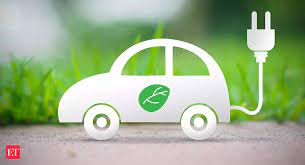
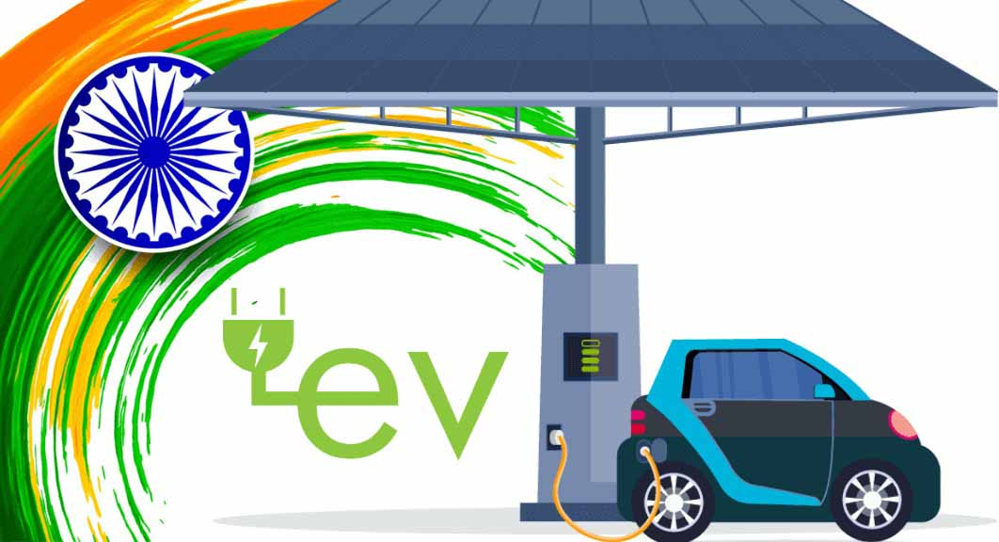

 
  
<h1 align="center"> EV_Market_Segmentation_Analysis  </h1> 
     

 

<h3 align="center"> Feynn Labs verified Project 

<h2> :book:Introduction</h2>
On year 2023 India is going to lead the world on the global stage of G20 summit. G20 is a forum which focuses on the global good and welfare. Be it peace or unity, sensitivity towards the environment or sustainable development. Prime Minister of India has announced it is the big opportunity for India to lead the world on many fronts. To lead India on the sustainable development front India needs to reduce the carbon emission by 2050. To reduce the carbon emission one of the solutions is to reduce the emission from petrol and diesel vehicles by Electric    Vehicles. This is also a big business opportunity for India on the field of Electric Vehicle Market. Eletric Vehicle Market has so much potential to grow in the upcoming years.

<h2> :book:Problem Statement</h2>
Considering the demand for the Electric Vehicle in India the obvious questions arise that how to invest in the EV Market, what will be the most suitable market place to kick start the business in this field to meet the best opportunity for establishing a sustainable business. All these are the most basic and essential question is our problem statement.

<h2> :book:Data Collection: </h2>
Since the EV market is still o the growing stage and it is still in amateur phase because it's been only 7 years so far since it has started its journey from 2015. The time it took to grow here is not enough to provide sufficient data to perform any predictions using machine learning algorithms still there is a small amount of data but sufficiently authentic data, is available on some government body’s websites in India are as follows:
https://vahan.parivahan.gov.in/vahan4dashboard/vahan/view/reportview
https://data.gov.in/search?title=electric%20Vehicle%20
Link to the Data set collected:
EV_Market_Segmentation/DataSet at main · sushant8525/EV_Market_Segmentation (github.com)

<h2> :book:Data Description</h2>
	
*Brand	Model:Here are some of the top EV manufacturers to watch this year:Tesla.BMW.Nissan.Chevrolet.Ford.Volkswagen.Kia.
	
*Accel:the time that it takes to reach a particular speed.	
	
*TopSpeed: highest speed achived by car
	
*Range:“Range” refers to the distance an electric or hybrid vehicle can travel before the battery needs to be recharged.
	
*Efficiency:	a measure of how much a car will convert energy in fuel into kinetic energy to travel.
	
*FastCharge:	significantly faster than regular AC charging stations taking between 15 and 45 minutes to charge most passenger electric vehicles up to 80 percent—making it quick and easy to charge on the go.
	
*RapidCharge:Rapid chargers are the fastest way to charge your electric vehicle, providing between 60-200 miles of range in 20-30 mins.
	
*PowerTrain:A powertrain is an assembly of every component that pushes your vehicle forward	
	
*PlugType:	Type 1 is common for American vehicles, it’s a single-phase plug and can charge at a speed of up to 7.4 kW.
 Type 2 is standard for European and Asian vehicles from 2018 onwards, it’s a triple-phase plug and can charge at a level of up to 43 kW.
	
*Segment:A, B, C, D, E and M: Different car segments
	
A-segment (Mini hatchbacks)	
	
B-segment (Hatchbacks)
	
C-segment (Sedans)
	
D-segment (Mid-size luxury sedans)
	
E-segment (Executive sedans)
	

*Seats:	no. of seats in car 
	
*PriceINR_in_Lakhs: exshowroom  price of car

<h2> :book:Depoyment on render</h2>

[(https://ev-market-segmentation-00gx.onrender.com/
)

https://ev-market-segmentation-00gx.onrender.com/

<h2> :book: conclusion on EV market in india</h2> 
	
* most of EV chargers Sanctioned in maharashtra and tamil nadu
	
*EV_Charging_Facility_available Rajasthan ,madhya pradesh and uttar pradesh
	
*high sales of EV 'karnatak , tamil nadu , maharashtra'
	
*top vehicle_class in 'Electric M-CYCLE/SCOOTER ','E-RICKSHAW ','MOTOR CAR' ,'MOPED' ,'E-RICKSHAW WITH CART'
	
*most of electric segment full fill 'bhart stage 6' norms

